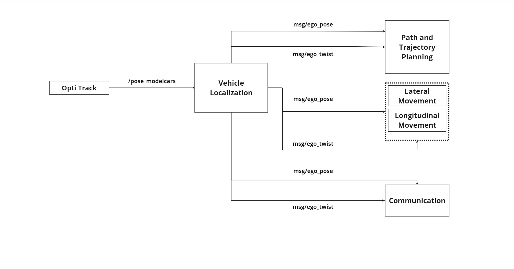
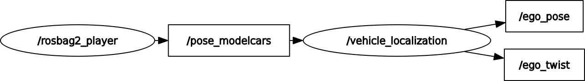

# Localization
ROS2 Localization repository(Team Elite).

## Main Contributor
([@Nirsitha](https://git.hs-coburg.de/Nirsitha))

## Component Description
The Localization Component determines the precise position and orientation of the autonomous pupil shuttle using OptiTrack motion capture data. It provides real-time pose information to support navigation and path planning, ensuring safe and efficient operation.

The block diagram below illustrates the connected components involved in the Localization Component:



## Table of Contents
- [Nodes](#nodes)
- [RQT_graph](#rqt_graph)
- [Installation](#installation)
- [Usage](#usage)
- [Testing](#testing)
- [License](#license)


## Nodes
### Node: `Localization`
#### Topics

| **Topic Name**            | **Input/Output**    | **Message Type**             | **Description** |
|---------------------------|---------------------|------------------------------|-----------------|
| `/pose_modelcars`         | **Input**  | `geometry_msgs/PoseStamped`  |Subscribe the position and orientation data of multiple rigid bodies from OptiTrack (e.g., cars). |
| `geometry_msgs/ego_pose`     | **Output**   | `geometry_msgs/msg/Pose`     |Publishes the position and orientation of a team elite rigid body  to Path and Trajectory planner, longitudinal and lateral controller, communication components|
| `/ego_twist`     | **Output**  | `geometry_msgs/msg/Twist`     |Publishes the angular and linear velocity of a team elite rigid body to Path and Trajectory planner, longitudinal and lateral controller, communication components|


## RQT_graph



This ROS node processes motion capture (mocap) data recorded in a ROS bag file. It subscribes to the /pose_modelcars topic from the bag file, which provides pose data for model cars from ModelCity. The node republishes this data as ego_pose. Additionally, the node generates random linear and angular velocity values using the random module and publishes these velocities as ego_twist.

## Installation
1. Clone the repository:
```bash
 git clone https://git.hs-coburg.de/The_ELITE/TheElite_Localization.git
 git clone https://git.hs-coburg.de/pau5849s/mocap_msgs.git
```
2. Build the package:
```bash
 colcon build --packages-select loc_package
```
3. Source the workspace:
```bash
 source install/setup.bash
```

## Usage
### Launching the Nodes
To launch all of the nodes in lateral control package, run the following command:

```bash
ros2 run vehicle_localization loc_package 
```

## License

This project is licensed under the **Apache 2.0 License** - see the [LICENSE](LICENSE) file for details.


